# Multimodal RAG cho 10 triệu tài liệu pháp lý

**Người thực hiện:** Nguyễn Hữu Thành - 2A202602807

**Vai trò giả định:** Architect on-call

**Mục tiêu:** retrieval p95 dưới 200 ms, truy vết được kết quả sau 5 năm

## 1. Bài toán và phạm vi

Văn phòng luật cần RAG trên 10 triệu PDF tiếng Việt, gồm text, trang scan
và bảng. Corpus có khoảng 30 tỉ token; với chunk 600 token và overlap 15%,
hệ thống sinh xấp xỉ 58,8 triệu chunk. Embedding được nâng cấp ít nhất hai
lần, nhưng truy vấn cũ phải tái lập được sau 5 năm. Search phải có p95 dưới
200 ms, không làm lộ tài liệu ngoài phạm vi truy cập của matter/khách hàng.

Phần khó không chỉ là tìm vector nhanh. PDF có thể được thay thế, OCR có thể
sai, ACL thay đổi và external index có thể trễ hơn lakehouse. Kiến trúc vì thế
phải tách system of record khỏi serving index, ghi rõ document/chunk/embedding version,
và lưu retrieval provenance thay vì hy vọng một index mutable sẽ tồn tại 5 năm.

### Giả định thiết kế

- PDF trung bình 8 MB, tổng raw hiện tại khoảng 80 TB; trung bình 20 trang/PDF.
- Tải phục vụ giả định 50 QPS thường xuyên, peak 200 QPS; p95 200 ms được đo tại peak.
- 2% tài liệu có version mới mỗi tháng; xóa logic không đồng nghĩa xóa ngay bản lưu phục vụ legal hold.
- Embedding 1.024 chiều; bản canonical dùng float16, index phục vụ truy vấn dùng PQ code.
- Đơn giá trong mục chi phí là giả định làm tròn để so sánh kiến trúc,
  không phải báo giá của nhà cung cấp.

## 2. Kiến trúc đề xuất

```mermaid
flowchart LR
    A[PDF intake + checksum] --> B[Bronze: immutable PDF pointer\ningest manifest + ACL]
    B --> C[OCR/layout/table parser\nquarantine on contract failure]
    C --> D[Silver Delta: document_version\nchunks + multimodal pointers]
    D --> E[Embedding jobs v1/v2\nversion-pinned Delta writes]
    E --> F[Gold retrieval snapshot\nCDF watermark + index manifest]
    F --> G[IVF-PQ derived index\n2 replicas + exact reranker]
    G --> H[RAG API\nACL pre-filter + citation]
    H --> I[Retrieval audit\nquery hash, versions, top-k]
    I --> D
    D -. time travel / RESTORE .-> E
    F -. blue-green alias .-> G
```

Sơ đồ áp dụng trực tiếp các concept Day18: medallion Bronze-Silver-Gold,
Delta ACID và schema enforcement, time travel/version pin, CDF đồng bộ index, external
index là derived state, cùng lifecycle/compaction cho file nhỏ. Query path không đọc PDF
trực tiếp: nó lọc ACL, tìm candidate trong IVF-PQ, rerank vector float16, sau đó
mới dereference các page pointer của top-k.

### Hợp đồng dữ liệu cốt lõi

Mỗi bản ghi chunk có khóa `(document_id, document_version, chunk_id,
embedding_version)`. `content_hash` xác nhận nội dung; `object_uri`, `page_from`,
`page_to` trỏ về bằng chứng gốc; `acl_scope`, `legal_hold`, `valid_from`, `valid_to`
phục vụ governance. Mỗi index build sinh `retrieval_snapshot_id`, ghi Delta version,
embedding model checksum, index parameters, CDF watermark và checksum của artifact.

## 3. Các quyết định có thể bảo vệ trong design review

### Quyết định 1 - Delta là system of record

Tôi chọn **Delta Lake trên object storage** cho manifest, chunk, embedding và audit.
Transaction log cho phép atomic publish, schema enforcement, CDF và pin version cho training
hoặc index build. Tôi không khẳng định Delta tự nó đáp ứng 200 ms; serving index
là một artifact khác.

- Loại **Lance làm bảng canonical duy nhất**: Lance hấp dẫn cho random access/vector,
  nhưng đổi toàn bộ audit, CDF và job lakehouse sang một format serving-centric làm
  tăng blast radius. Lance vẫn có thể được benchmark như derived index sau này.
- Loại **các thư mục Parquet thuần**: rẻ và dễ ghi, nhưng không có atomic
  multi-file commit, schema evolution có kiểm soát hay delete feed. Lỗi nửa commit có thể
  tạo một corpus mà indexer đọc khác với job audit.

### Quyết định 2 - Blob để ngoài bảng, bảng chỉ giữ pointer

Tôi chọn **mỗi PDF gốc là object bất biến có checksum**. Delta giữ URI và phạm vi
trang; text OCR, table structure và thumbnail nhỏ mới được columnar hóa. Thiết kế
này giữ scan phân tích nhẹ trong khi một citation vẫn truy về đúng trang gốc.

- Loại **nhét binary PDF/scan vào Parquet row**: projection pushdown bảo vệ full scan,
  nhưng random read một trang có thể buộc đọc cả row group, đúng amplification
  đã đo trong NB7.
- Loại **tách mọi trang thành object riêng ngay khi ingest**: 200 triệu page object
  làm phí listing, request và lifecycle tăng mạnh. Chỉ materialize page image cho trang
  thật sự cần OCR/debug; còn lại dùng PDF pointer cùng page range.

### Quyết định 3 - Version tường minh, không phụ thuộc riêng time travel

Tôi chọn **immutable `document_version`, `embedding_version` và
`retrieval_snapshot_id`**. Delta time travel hỗ trợ rollback vận hành, còn reproducibility
5 năm được bảo đảm bằng manifest, object hash, model checksum và retrieval audit.
Kết quả top-k và score được lưu cùng trích dẫn, vì hai lần build approximate
index không nhất thiết có thứ tự bit-for-bit giống nhau.

- Loại **overwrite embedding cũ**: rẻ trước mắt nhưng phá trích dẫn cũ và
  không thể so sánh model upgrade.
- Loại **giữ toàn bộ bằng Delta time travel 5 năm mà không có manifest**: một
  lệnh VACUUM sai retention có thể phá cam kết. Time travel là công cụ vận hành,
  không thay thế bằng chứng bất biến và bản archive.

### Quyết định 4 - Partition thô, clustering theo đường truy vấn

Tôi chọn **partition Silver theo `embedding_version` và `ingest_month`, sau đó
cluster theo `acl_scope`, `document_id`**. Partition có cardinality hữu hạn; clustering giúp
audit theo matter/document skip file. Job compaction chạy sau ingest burst và nhắm file
256-512 MB, thay vì chạy theo lịch cố định khi không có file nhỏ.

- Loại **partition theo `document_id`**: 10 triệu partition sinh metadata và small-file
  problem; catalog/listing trở thành bottleneck trước cả compute.
- Loại **partition chỉ theo ngày ingest**: dễ vận hành nhưng rebuild một embedding
  version và audit theo ACL phải quét nhiều partition không liên quan.

### Quyết định 5 - IVF-PQ cho candidate, exact rerank cho chất lượng

Tôi chọn **IVF-PQ sharded theo `embedding_version`, hai replica, sau đó exact rerank
top 200** bằng vector float16 trong lakehouse/cache. Với gần 59 triệu vector, PQ code
128 byte cần khoảng 7,5 GB; cộng ID, inverted lists và 30% overhead, một index xấp xỉ
15 GB. Hai version và hai replica cần khoảng 60 GB - vừa với bốn node 32 GB.

- Loại **HNSW full precision cho toàn corpus**: latency và recall tốt, nhưng vector
float16 đã khoảng 120 GB/version; cộng graph, hai version và hai replica có thể
vượt 500 GB RAM, không hợp lý cho mức tải giả định.
- Loại **brute-force SQL làm serving path**: rất hữu ích để tạo ground truth và
recall test, nhưng scan 59 triệu vector cho mỗi query không thể giữ p95 200 ms.

### Quyết định 6 - Catalog tập trung và ACL trước vector search

Tôi chọn **một catalog quản trị tập trung** cho Delta tables, service identity và
audit; query service nhận `acl_scope` từ identity layer và pre-filter candidate. Catalog
không phải nơi lưu vector index, nhưng là nơi công bố bảng và policy.

- Loại **cho service đọc table bằng raw object path**: nhanh lúc demo nhưng bypass
  grant, lineage và audit; một URI bị lộ có thể biến thành data leak.
- Loại **mỗi team một catalog và bản sao corpus**: giảm va chạm tổ chức nhưng
  tạo nhiều ACL truth, không biết index nào đã nhận delete và tăng storage.

### Quyết định 7 - Blue-green cho embedding/index lifecycle

Tôi chọn **dual-write theo version và blue-green alias**. Indexer đọc CDF từ một
Delta version đã pin, build index xanh, chạy recall/ACL/delete canary, sau đó atomically
đổi alias. Index cũ chỉ bị archive sau khi hết rollback window; manifest và audit
vẫn giữ 5 năm.

- Loại **rebuild-in-place**: tiết kiệm một bản index nhưng mixed embeddings làm
  score không còn so sánh được và rollback gần như không thể.
- Loại **big-bang cutover không shadow traffic**: nhanh hơn một ngày nhưng chỉ phát
  hiện recall regression, ACL filter bug hoặc p95 spike khi người dùng thật đã vào.

## 4. Failure modes lúc 03:00

| Sự cố | Phát hiện | Cô lập và rollback |
|---|---|---|
| OCR/parser mới làm 30% chunk rỗng hoặc đổi kiểu cột | Data contract chặn schema; quality gate theo dõi null rate, token/page và quarantine rate theo parser version | Dừng publish Silver, giữ Bronze bất biến, RESTORE Delta về version tốt và replay riêng file quarantine. Đây là schema enforcement + time travel, không phải xóa log. |
| Indexer trễ CDF hoặc bỏ sót delete, index vẫn trả tài liệu đã thu hồi ACL | Alert khi `table_version - index_watermark > 2`; canary xóa một doc và yêu cầu 0 hit trong 60 giây; đối soát ID hàng giờ | Hạ alias index lỗi, chuyển về replica cũ an toàn hoặc tạm chặn scope; replay idempotent CDF từ watermark đã commit. Nếu mất checkpoint, rebuild từ pinned snapshot. |
| Embedding v2 đạt latency nhưng recall pháp lý giảm | Golden set theo loại văn bản; so recall@10, citation accuracy, nDCG và p95 trên shadow traffic | Không đổi alias nếu recall@10 giảm quá 2 điểm %; nếu đã cutover, atomically trỏ alias về v1. Hai version không ghi đè nhau. |
| VACUUM/retention sai làm mất file cần cho audit 5 năm | Policy-as-code chặn retention dưới ngưỡng; job hàng ngày kiểm tra manifest hash và thử replay một truy vấn cũ | Không chỉ dựa vào Delta log: khôi phục object/version manifest từ immutable archive, đăng ký lại snapshot và rebuild index artifact. |
| Lỗi ACL pre-filter làm lộ tài liệu matter khác | Synthetic forbidden-query canary mỗi phút; audit so sánh scope của user với top-k; alert ngay khi có một mismatch | Disable search alias cho scope bị ảnh hưởng, rollback policy bundle, thu hồi cache và truy vết mọi response từ retrieval audit. Không trông chờ post-filter sau khi nội dung đã vào prompt. |

## 5. Ước lượng storage và compute

### Storage steady-state

| Hạng mục | Phép tính | Chi phí/tháng |
|---|---:|---:|
| PDF hot (20%) | 16 TB x 23 USD/TB | 368 USD |
| PDF warm/cold (80%) | 64 TB x 4 USD/TB | 256 USD |
| Immutable archive hiện tại | 80 TB x 1,5 USD/TB | 120 USD |
| Version delta 5 năm, tính trung bình | (1,6 TB/tháng x 60 / 2) x 1,5 USD/TB | 72 USD |
| OCR text, chunk, audit và Delta log | 1,0 TB x 23 USD/TB | 23 USD |
| Hai bản embedding float16 | 58,8M x 1.024 x 2 byte x 2 x 1,3 overhead = 313 GB | 7 USD |
| IVF-PQ, hai version, hai replica | khoảng 60 GB x 23 USD/TB | 2 USD |
| **Tổng storage làm tròn** | chưa gồm phí restore/egress hiếm gặp | **848 USD/tháng** |

Phép tính embedding cho thấy vector không phải phần storage lớn nhất; PDF và
version archive mới chi phối. Tuy nhiên vector index chi phối RAM/compute của search.
Metadata ratio và small files phải được theo dõi riêng; 58,8 triệu file chunk
sẽ phá kiến trúc dù tổng byte không lớn.

### Compute và chi phí build

- Search serving: `4 node x 0,70 USD/giờ x 730 giờ = 2.044 USD/tháng`.
- OCR incremental 2%/tháng: 4 triệu trang. Ở 120 trang/giây/GPU, nhân 3 cho
  layout/table/retry: `4M / 120 / 3.600 x 3 x 2,5 USD = 69 USD/tháng`.
- Embedding incremental: 600 triệu token/tháng, 50.000 token/giây/GPU, hệ số 1,5:
  `600M / 50K / 3.600 x 1,5 x 2,5 USD = 13 USD/tháng`.
- Spark/Delta compaction, quality và index publish: `2.000 vCPU-giờ x 0,06 USD = 120 USD/tháng`.
- Catalog, monitoring và audit log: reserve `300 USD/tháng`.

Tổng run-rate ước tính là `848 + 2.044 + 69 + 13 + 120 + 300 = 3.394
USD/tháng`, chưa gồm LLM inference, network egress và nhân sự. Backfill ban đầu
cho 200 triệu trang ước `200M / 120 / 3.600 x 3 x 2,5 = 3.472 USD`; một lần
embed toàn bộ 30 tỉ token khoảng `30B / 50K / 3.600 x 1,5 x 2,5 = 625 USD`.
Hai lần regenerate là 1.250 USD nếu throughput giả định giữ được.

## 6. MVP một tuần

MVP không giả vờ ingest 10 triệu PDF trong bảy ngày. Slice nhỏ nhất chứng minh
kiến trúc là **10.000 PDF thật đã khử nhận dạng, khoảng 60.000 chunk thật,
hai embedding version và một delete/ACL lifecycle hoàn chỉnh**. Bài load test bổ sung
940.000 vector synthetic cùng phân bố norm/chủ đề để đạt 1 triệu vector; số synthetic
chỉ được dùng đo capacity, không được dùng báo cáo recall/chất lượng.

| Ngày | Sản phẩm |
|---|---|
| 1 | Chốt data contract, golden queries, ACL test identities; ingest PDF pointer + checksum vào Bronze. |
| 2 | OCR/layout parser, quarantine, Silver `document_version`/chunk; test idempotent rerun và schema mismatch. |
| 3 | Sinh embedding v1/v2, ghi `embedding_version`, compaction và clustering; chốt Delta version cho hai build. |
| 4 | Build hai IVF-PQ index từ pinned snapshot; ghi manifest, checksum, CDF watermark; tạo exact ground truth. |
| 5 | RAG API có ACL pre-filter, top-200 rerank, citation page pointer và retrieval audit. |
| 6 | Shadow traffic; fault injection cho parser bad schema, CDF lag, delete và rollback alias v2 sang v1. |
| 7 | Load test, recall report, cost extrapolation, runbook on-call và design review. |

### Tiêu chí nghiệm thu

1. p95 dưới 200 ms trên 1 triệu vector ở 200 QPS, tối đa 50 query đồng thời; báo cáo tách ANN,
   rerank và object fetch, không chỉ nêu tổng latency.
2. Trên 60.000 chunk thật, recall@10 của IVF-PQ sau rerank tối thiểu 0,90 so với brute-force ground truth;
   citation accuracy trên golden set tối thiểu 0,95.
3. Một document bị delete hoặc thu hồi ACL có 0 hit trong table và index trong 60 giây;
   canary phải thất bại nếu cố tình dừng CDF consumer.
4. Cùng `retrieval_snapshot_id` tái hiện đúng document/chunk ID và citation đã
   lưu sau khi alias chuyển từ v1 sang v2. Đây là mechanism khó nhất của MVP.
5. RESTORE Silver về version tốt và rebuild index từ manifest hoàn thành trong 30 phút
   ở quy mô MVP; không sửa tay row hay copy index không có checksum.

## 7. Ranh giới của thiết kế

Tài liệu này là architecture estimate, không phải capacity test. Con số 200 ms chỉ
được chốt sau benchmark với phân bố query và ACL thật. Thiết kế cũng không coi
versioning là bằng chứng văn bản pháp lý có hiệu lực; domain expert vẫn phải xác nhận
nguồn, thời điểm và thẩm quyền. RAG response luôn hiển thị citation và không thay
thế ý kiến chuyên môn.

## Tài liệu đối chiếu

- `docs/bonus/BONUS-CHALLENGE.md` - ràng buộc topic D và rubric bonus.
- `notebooks/07_vectors_multimodal.py` - amplification, quantization, SQL search, CDF delete và stale-index lifecycle.
- `notebooks/03_time_travel.py` - version pin, time travel và RESTORE.
- `notebooks/06_maintenance.py` - compaction, clustering, retention, vacuum, orphan sweep và checkpoint.
- `notebooks/08_agents_provenance.py` - versioned replay, audit và giới hạn của provenance minh họa.
